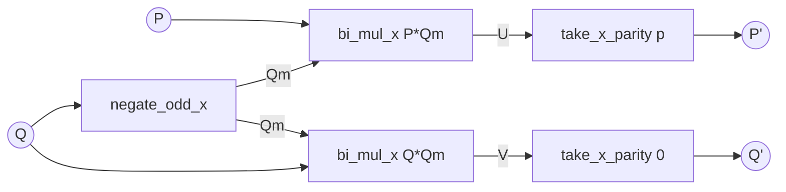

# Forward-dual DAG and its transposition

Operation-level decomposition of `extract_dual(c, g, n, m)`
(`dual_extraction.hpp`) and the transposed counterpart used by
`compose_kl_tellegen(f, g, n)`.

## 1. Dual problem

`extract_dual` computes the linear map `c -> d = M^T c` with

```
M[i][j] = [x^i] g(x)^j,   i = 0..n-1,  j = 0..m-1.
```

Equivalently:

```
d_j = sum_{k=0..n-1} c_k * [x^k] g(x)^j.
```

Composition `compose(f, g, n)` is the primal map `f -> M f`:

```
[f(g)]_i = sum_{j=0..m-1} M[i][j] * f_j   with m = n.
```

By Tellegen's principle, an algorithm computing `M^T` in time `T(n)` admits
a transposed algorithm computing `M` in time `T(n) + O(n)`.

## 2. Forward-dual DAG (one outer iteration)

Notation:

```
P : BiPoly with deg_x = n_x - 1, deg_y < m   (numerator)
Q : BiPoly with deg_x = n_x - 1, deg_y < m   (denominator)
```

Initialisation:

```
P_0(x, y) = rev_n(c)(x),    Q_0(x, y) = 1 - y * g(x).
```

One outer step with parity `p = target_x mod 2`:

| step | operation                                          | shape                                |
|------|----------------------------------------------------|--------------------------------------|
| (a)  | `Qm := negate_odd_x(Q)`                            | self-transpose, in-place             |
| (b)  | `U  := bi_mul_x(P,  Qm)  mod x^{x_cap} mod y^m`    | bivariate convolution in x           |
| (c)  | `V  := bi_mul_x(Q,  Qm)  mod x^{x_cap} mod y^m`    | bivariate convolution in x           |
| (d)  | `P' := take_x_parity(U, p)`                        | downsample-by-2 along x (offset = p) |
| (e)  | `Q' := take_x_parity(V, 0)`                        | downsample-by-2 along x (offset = 0) |

After `O(log n)` outer steps `target_x = 0` and `d = P[0]` (a polynomial in
y of length `m`).



The full forward-dual DAG is `O(log n)` such layers plus the input
operations `c -> P_0` (`rev_n` packed into the y^0 column) and `g -> Q_0`
(g is data; its handling is a no-op under transposition).

## 3. Transposed DAG (compose_kl_tellegen)

The transposed algorithm walks the DAG right to left with each operation
replaced by its transpose. Inputs and outputs swap:

* dual: consumes `c` (length `n`), produces `d` (length `m`);
* transposed: consumes `f` (length `m`), produces `f(g)` (length `n`).

`g` is fixed in both directions.

### 3.1 Per-operation transposition table

| forward op (consumes -> produces)                           | transposed op (consumes -> produces)                              |
|-------------------------------------------------------------|--------------------------------------------------------------------|
| `take_x_parity(U, p) -> P'`                                 | `interleave_x_parity(P', p) -> U_t`                                |
| `bi_mul_x(P, Qm) mod x^{x_cap}` (Qm is data)                | `bi_middle_product_x(Qm, U_t)` returning the first `x_cap` x-rows |
| `negate_odd_x(Q)`                                           | `negate_odd_x` (self-transpose)                                    |
| pack `rev_n(c)` into y^0 column                              | read y^0 column, then `rev_n`                                      |

Notes:

* `bi_mul_x` with one fixed operand `Qm` is linear in `P`; its transpose
  with respect to `P` is the bivariate middle product against `Qm`. The
  transpose of `bi_mul_x(Q, Qm)` w.r.t. `Q` is symmetric.
* `Q` evolves through `g` only, not through the linear input. On the
  transposed side `Q` and `Qm` are precomputed once per outer iteration.

### 3.2 Transposed outer loop

```
forward direction:    target_x = n-1 -> ... -> 0
transposed direction: target_x = 0   -> ... -> n-1
```

At each transposed step:

```
input:  P_acc (current contracted x-domain representation)
        Q, Qm (precomputed at this level from the forward sweep)

P_t := interleave_x_parity(P_acc, parity_at_this_level)
P_at_higher_level := bi_middle_product_x(Qm, P_t, x_cap_higher)
```

`Q` updates are not transposed in the linear sense (data flow, not P flow).
The forward Q sweep is run once and the level sequence
`(Q_level, Qm_level, parity_level, x_cap_level)` is replayed in reverse.

### 3.3 Endpoints

* Initial transposed state: `P_acc` is a bi-poly with one row
  `P_acc[0] = f` (length `m`, padded). This is the transpose of "extract
  row 0 of P at the end of the forward sweep" (which produced `d = P[0]`).
* Final state: a bivariate `P_n` with x-extent `n` and y-extent `m`. The
  output `f(g) in R^n` is read from the `y^0` column of `P_n` and reversed.

### 3.4 Cost

Each outer step runs two bivariate `middle_product`s of x-extent `x_cap`
and y-extent at most `m`. Per-y-column `middle_product` (`mp_ntt` for
`ModInt998`) costs `O(x_cap * deg_y * log x_cap)`. Summed over `O(log n)`
levels with halving `x_cap` and bounded `deg_y <= m`, the total is
`O(n m polylog n)`.

For `m = n` this matches the cost of `extract_dual` (the bottleneck is the
per-y-pair loop in `bi_mul_x_truncated`). Reaching `O(n log^2 n)` requires
a joint y-axis convolution or the additional y-axis Bostan-Mori
contraction; see `ALGORITHMS.md` §8.6.

## 4. Implementation steps

1. Forward sweep `dual_detail::sweep_forward(g, n, m)` returning
   `vector<{Q_level, Qm_level, parity_level, x_cap_level}>`.
2. `bi_middle_product_x(B, U, x_cap, m_cap)` in `dual_extraction.hpp`.
3. `interleave_x_parity(P, parity, target_x)` — adjoint of
   `take_x_parity`, inserting zero rows.
4. `compose_kl_tellegen(f, g, n)`:
   * call `sweep_forward(g, n, n)` to obtain levels;
   * initialise `P_acc[0] = f`;
   * walk levels in reverse, applying `interleave_x_parity` then
     `bi_middle_product_x` against `Qm_level`;
   * extract the answer by reading the y^0 column and reversing.
5. Validate against the control tests; promote to `KLVariant::Tellegen`
   only after bit-for-bit agreement.
